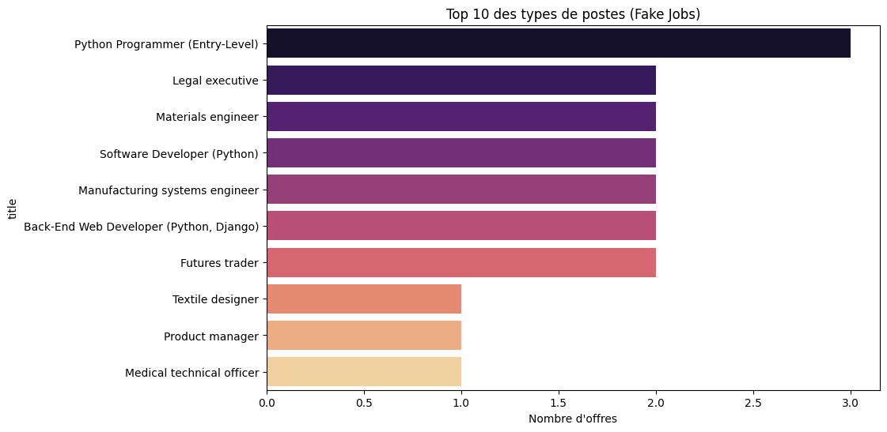

# job-market-analyzer-2025

#  Job Market Trends Analyzer 2025


##  Project Overview
Ce projet a pour but d'analyser les tendances du marché de l'emploi (compétences demandées, types de postes, localisations) en utilisant une approche Data-Driven.

L'objectif est de transformer des données brutes issues d'offres d'emploi en insights stratégiques pour les candidats et recruteurs.

##  Tech Stack
* **Language:** Python
* **Scraping:** Requests, BeautifulSoup4
* **Data Manipulation:** Pandas, NumPy
* **Visualization:** Matplotlib, Seaborn
* **Environment:** Jupyter Notebook, VS Code

##  Key Insights (Preview)
Analyses préliminaires sur un dataset de test (Fake Jobs) :



*Le graphique ci-dessus montre la répartition des intitulés de poste les plus fréquents.*

## 📂 Project Structure
```text
├── data/               # Raw and processed datasets
├── notebooks/          # Jupyter Notebooks for exploration
├── src/                # Source code (Scrapers, Cleaning scripts)
├── requirements.txt    # Python dependencies
└── README.md           # Project documentation